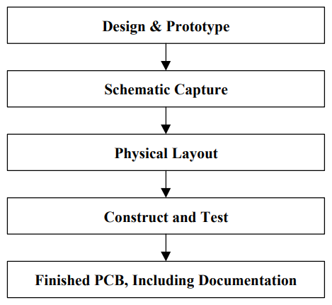
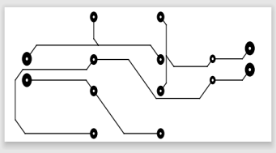
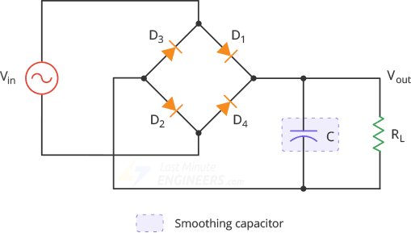
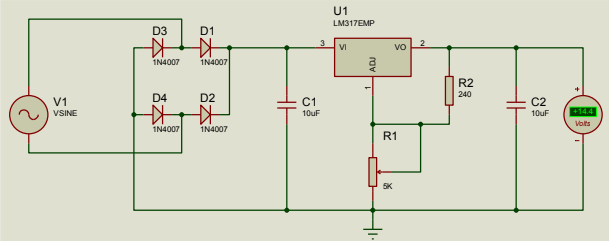

# **Full-Wave Bridge Rectifier Implementation using PCB Design**

## **Project Overview**

This project demonstrates the implementation of a full-wave bridge rectifier circuit using PCB design. The experiment focuses on designing, fabricating, soldering, and testing a PCB-based rectifier circuit.

The circuit was designed and simulated using Proteus 8 Professional. After simulation, the PCB layout was created, printed, transferred onto a copper-clad board, etched, drilled, and soldered. The final circuit was tested using measuring instruments and an oscilloscope.

This project helps to understand practical PCB design, soldering, rectifier circuit implementation, and output waveform observation.

## **Objectives**

* To learn the practical step-by-step procedure of PCB design.
* To become familiar with soldering accessories and their practical applications.
* To design and implement a complete circuit using PCB design and soldering.
* To learn the proper use of chemicals, tools, and components while maintaining safety.
* To design a PCB layout using Proteus 8 Professional.
* To make a PCB from a copper-clad board by printing, transferring, and etching the circuit layout.
* To test the output of the implemented rectifier circuit.

## **Theory**

A printed circuit board, commonly known as PCB, mechanically supports and electrically connects electronic components using conductive tracks, pads, and copper layers.

In this experiment, the work was divided into two major parts:

```text
1. PCB design according to the circuit
2. Soldering the components on the PCB and checking the output
```

A full-wave bridge rectifier converts AC voltage into pulsating DC voltage using four diodes arranged in a bridge configuration. During both positive and negative half cycles of the AC input, current flows through the load in the same direction, producing a rectified DC output.

The circuit also includes filtering and regulation components to obtain a smoother DC output.

## **Required Equipment and Components**

* Centre-tapped transformer: 230/24 V
* Resistor: 240 kΩ
* Capacitor: 10 µF
* IC LM317
* Diode: 1N4007, 4 pieces
* Project board
* Digital multimeter: DT9205A
* Oscilloscope
* Proteus 8 Professional
* Laser printer
* Household clothes iron
* Copper-clad laminate
* Etching solution
* Kitchen scrubs
* Thinner or acetone
* Blade cutter
* Permanent black marker
* Sandpaper
* Cotton wool
* Soldering iron
* Soldering wire
* Drill machine

## **PCB Design Flow**

### **Figure 1: PCB Design Flow**




This figure shows the basic PCB design flow, including design and prototype, schematic capture, physical layout, construction, testing, and final PCB documentation.

## **Circuit Design and Simulation**

### **Figure 2: Circuit Diagram**




This figure shows the basic circuit diagram of the full-wave bridge rectifier.

### **Figure 3: Circuit Simulation in Proteus Software**



This figure shows the simulation of the circuit using Proteus 8 software before PCB layout design.

### **Figure 4: Variable DC Power Supply Unit using LM317**




This figure shows the rectifier and regulator circuit using four 1N4007 diodes, capacitor, resistor, and LM317 voltage regulator IC.

## **PCB Layout**

### **Figure 5: PCB Layout of Required Circuit**


This figure shows the PCB layout designed for the required rectifier circuit. The layout contains copper tracks and component placement points.

## **Circuit Implementation**

### **Figure 6: Soldering Process**


This figure shows the soldering process on the PCB board after etching and drilling.

### **Figure 7: 3D View of PCB Design**


This figure shows the 3D view of the PCB design, including component placement.

### **Figure 8: Breadboard Testing of Circuit**


This figure shows the components placed on a breadboard for testing the circuit before final PCB implementation.

## **Output Waveshapes**

### **Figure 9: Oscilloscope Output Waveform 01**


This figure shows the observed output waveform on the oscilloscope during circuit testing.

### **Figure 10: Oscilloscope Output Waveform 02**


This figure shows another oscilloscope output observation of the implemented rectifier circuit.

## **PCB Making Procedure**

The PCB was made using the following steps:

### **Step 1: Printout of Circuit Board Layout**

The PCB layout was printed using a laser printer on glossy paper. The output was printed in black for proper transfer onto the copper-clad board.

### **Step 2: Cutting and Cleaning the Copper Plate**

The copper board was cut according to the size of the layout. The copper surface was cleaned using steel wool or sandpaper to remove oxide and make the surface smooth.

### **Step 3: Ironing the Circuit Layout**

The printed layout was placed face down on the copper surface and heated with a household iron. The heat transferred the toner from the glossy paper to the copper board.

### **Step 4: Transferring the PCB Print**

The printed image was transferred properly onto the copper plate. The board and paper were aligned carefully before applying heat.

### **Step 5: Peeling**

After ironing, the board was placed in lukewarm water. The paper was removed gently. If any track became faint, it was darkened using a permanent black marker.

### **Step 6: Etching**

The board was dipped into ferric chloride solution. The exposed copper was removed through chemical reaction, leaving only the required copper tracks.

### **Step 7: Cleaning and Disposal**

The PCB was cleaned after etching. Safety precautions were followed while handling and disposing of the etching solution.

### **Step 8: Final Touches**

The remaining toner was removed using thinner or acetone. The board was dried, trimmed, drilled, and prepared for soldering.

### **Step 9: Drilling**

Holes were drilled using a drill machine for placing electronic components.

### **Step 10: Soldering**

The components were soldered carefully onto the PCB. Soldering created strong electrical connections between the components and copper tracks.

## **Result**

The full-wave bridge rectifier circuit was successfully implemented using PCB design. The circuit was tested after soldering, and the output was observed using an oscilloscope.

The output was satisfactory and fulfilled the objectives of the experiment.

## **Discussion and Conclusion**

The experiment was performed carefully to obtain maximum output and reduce error. Safety precautions were followed because hazardous tools and chemicals such as ferric chloride solution, drill machine, soldering iron, and household iron were used.

Some deviation was observed in the output waveform. When individual input and output were considered separately, the oscilloscope showed proper results. However, while observing both input and output waveform at the same time, some distortion was noticed.

Possible reasons for deviation include:

* Noise in the input signal
* Internal functionality of the oscilloscope and function generator
* Practical limitations of resistor, capacitor, and diode
* Impurities in PCB
* Soldering limitations
* Temperature rise

The overall error was small and negligible. The PCB was successfully made, and the output was satisfactory. Therefore, the experiment was completed successfully.

## **Applications**

* AC to DC conversion circuit
* DC power supply design
* Electronics laboratory practice
* PCB design learning
* Soldering practice
* Rectifier circuit implementation
* LM317-based variable DC supply project

## **Limitations**

* Practical output may differ from theoretical output.
* Diode voltage drop affects the output voltage.
* Noise may appear in oscilloscope waveform.
* PCB impurities and soldering quality can affect performance.
* Manual PCB fabrication may cause small layout or etching errors.

## **Future Improvements**

* Use a better quality PCB fabrication process.
* Add a larger filter capacitor for smoother DC output.
* Add voltage and current display.
* Use proper enclosure for the circuit.
* Add protection fuse.
* Improve PCB layout for compact design.
* Add heat sink for voltage regulator.
